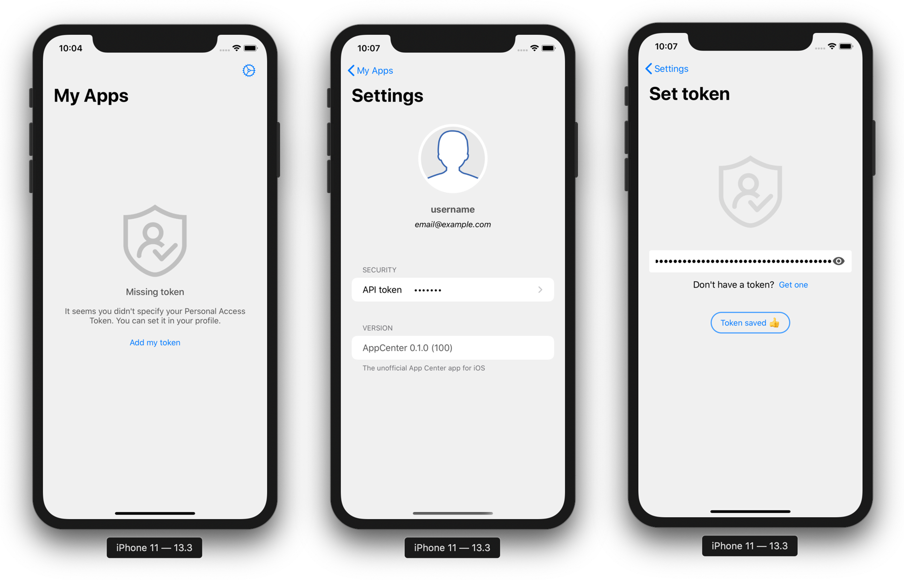
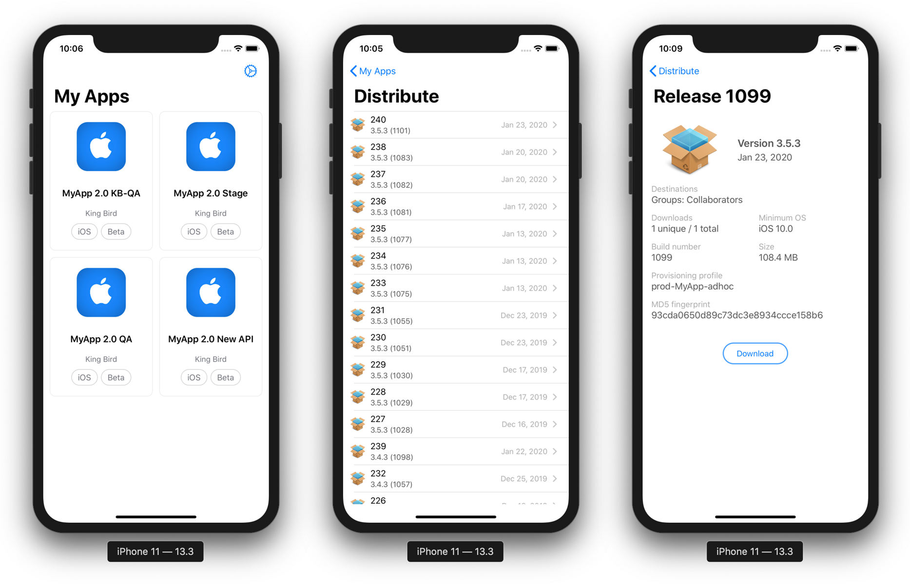

## Unofficial client for AppCenter.ms

Continuously build, test, release, and monitor apps for every platform. To work with the application, you must have a valid account in [AppCenter.ms](https://appcenter.ms/) and get the token API in [control panel](https://appcenter.ms/settings/apitokens).

## License

Unofficial client for AppCenter.ms is distributed under the MIT license.

